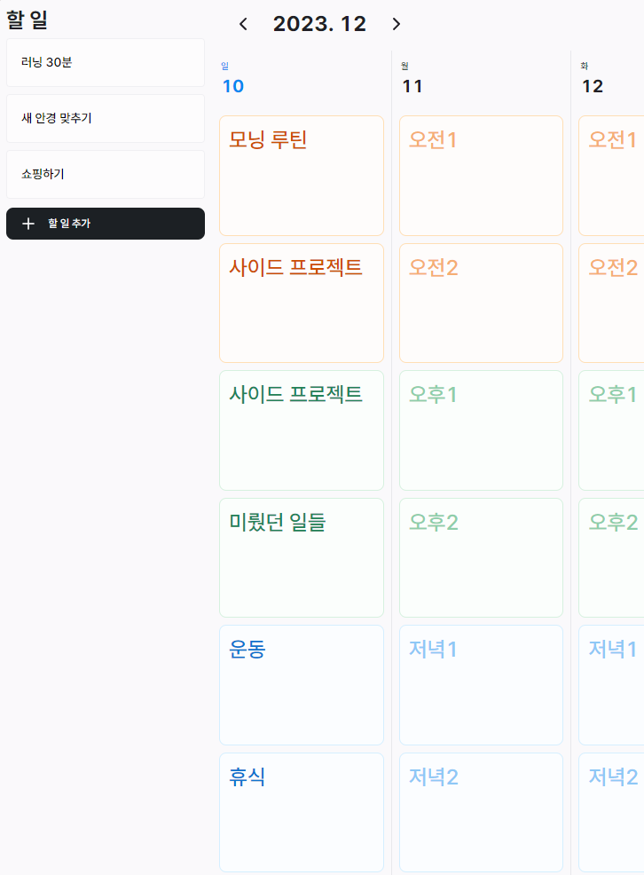

# Dayblocks

복잡한 나의 하루, 블럭으로 단순하게

["Block 6"](https://book.interpark.com/product/BookDisplay.do?_method=detail&sc.saNo=001&sc.prdNo=354308432) 라는 시간 관리 방법론을 아시나요? 하루를 6개(오전 2, 오후 2, 저녁 2)의 블럭으로 나눠서 인지적 부담을 최대한 줄여 효율적으로 시간을 관리하는 방법입니다.

나의 블럭을 어떻게 활용할 지 간단하게 적고, 블럭에 관련된 할 일을 배치하세요.

## Features

- 할 일 리스트
- 블럭 관리
- 지금 날짜를 기준으로 이전 주, 다음 주 전환
- 화이트 / 다크 테마

### Not yet implemented

- 할 일을 블럭에 할당
- 쉬운 습관 형성을 도와주는 반복 가능한 할 일
- 할 일 마감일 지정 / 알림
- 모바일 앱

## Development

1. git clone
2. `pnpm install`
3. `pnpm dev`

## References

- [블럭식스 레볼루션(Block 6 Revolution)](https://book.interpark.com/product/BookDisplay.do?_method=detail&sc.saNo=001&sc.prdNo=354308432)
- [일상의 황금비율을 찾는 일정 관리법](https://publy.co/content/7084)
